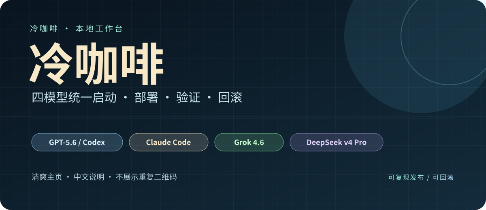
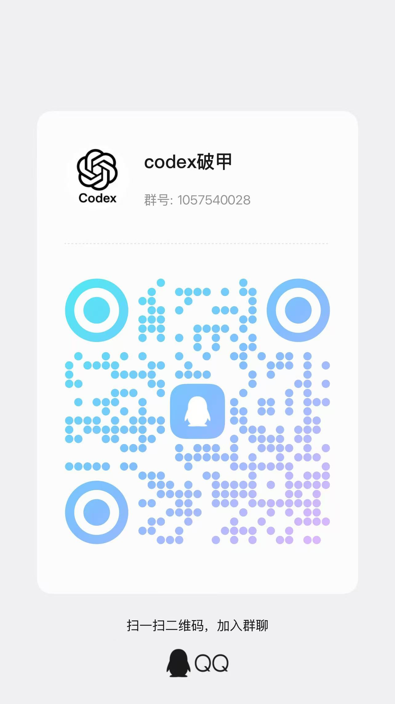
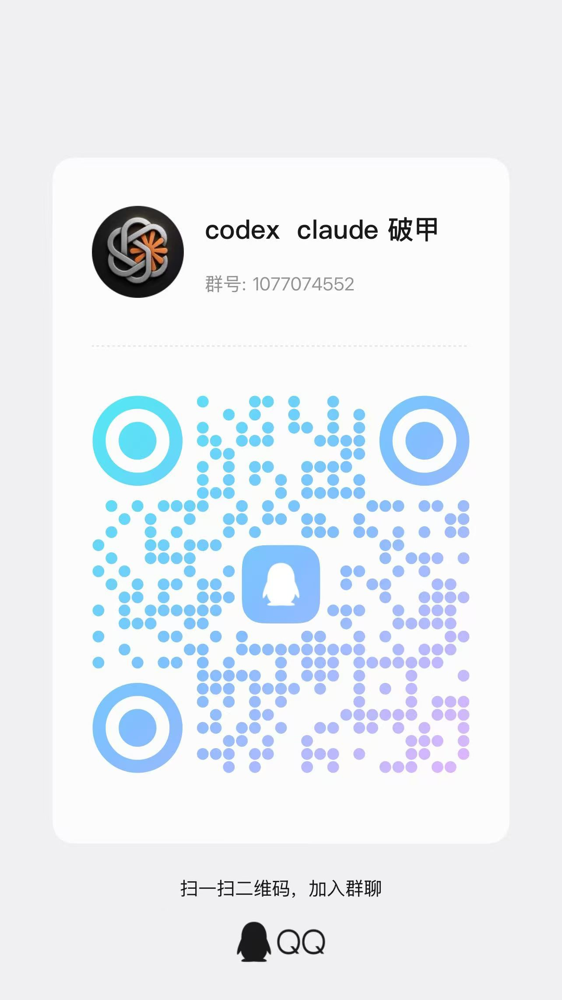

# ColdBrew 冷咖啡｜四模型工作台

<p align="center">
  
</p>

<p align="center"><strong>GPT-5.6 / Codex · Claude Code · Grok 4.6 · DeepSeek v4 Pro</strong></p>

<p align="center">
  <a href="#快速开始"></a>
  <a href="#快速开始"></a>
  <a href="#社区入口"></a>
</p>

> **项目定位：** 本地配置编排、工作流管理、可复现发布，以及支持回滚的部署工具。

## 主页导航

| 模块 | 入口 | 说明 |
| --- | --- | --- |
| 控制中心 | [`coldbrew_hub.py`](coldbrew_hub.py) | 四模型卡片、环境检查、部署、验证与恢复 |
| Grok 4.6 | [`projects/grok4.6-coldbrew`](projects/grok4.6-coldbrew) | Grok 适配器与统一深色界面 |
| DeepSeek | [`projects/deepseek-harness`](projects/deepseek-harness) | Harness 适配器与导出模板 |
| 发布工具 | [`pack_release.py`](pack_release.py) | 可复现 ZIP、SHA-256 校验和清单 |
| 社区入口 | [QQ / 微信 / Telegram](#社区入口) | 交流、更新与版本公告 |

## 四个模型

| 模型 | 目录 | 说明 |
| --- | --- | --- |
| GPT-5.6 / Codex | [`projects/codex-coldbrew`](projects/codex-coldbrew) | 本地配置与工作流入口 |
| Claude Code | [`projects/claude-coldbrew`](projects/claude-coldbrew) | Claude 工作流入口 |
| Grok 4.6 | [`projects/grok4.6-coldbrew`](projects/grok4.6-coldbrew) | Grok 适配器与统一界面 |
| DeepSeek v4 Pro | [`projects/deepseek-harness`](projects/deepseek-harness) | Harness 适配器与导出模板 |

## 本次升级

- **ColdBrew Hub v8：** 四模型卡片、状态检查、后台任务、部署验证、打包与恢复。
- **统一工作台：** Grok 4.6 与 DeepSeek Harness 使用同一套深色 Tkinter 界面。
- **可复现发布：** 固定文件顺序，并生成 SHA-256 校验清单。
- **整洁社区入口：** 主页采用紧凑的文字入口，不再堆叠重复二维码。

## 快速开始

1. 安装 Python 3.10 或更高版本，并确认包含 `tkinter`。
2. 克隆仓库：

   ```powershell
   git clone https://github.com/3641397194-wq/gpt5.6-claude-grok4.6-deepseekv4pro.git
   cd gpt5.6-claude-grok4.6-deepseekv4pro
   ```

3. 双击启动文件，或运行：

   ```powershell
   python coldbrew_hub.py
   ```

4. 在控制面板按以下顺序操作：

   ```text
   环境检查 -> 选择模型 -> 预览 -> 部署 -> 验证
   ```

5. 在模型卡片上点击 **恢复**，即可回到已保存的快照。

## 命令行

```powershell
python projects/grok4.6-coldbrew/app/grok_coldbrew.py --home "$env:USERPROFILE\.coldbrew\grok" preview --profile max --json
python projects/grok4.6-coldbrew/app/grok_coldbrew.py --home "$env:USERPROFILE\.coldbrew\grok" deploy --profile max --json
python projects/grok4.6-coldbrew/app/grok_coldbrew.py --home "$env:USERPROFILE\.coldbrew\grok" verify --json
python pack_release.py --all --json
```

## 验证与回滚

```powershell
python -m compileall -q .
python coldbrew_hub.py --selftest
```

部署前先执行预览。每个适配器都会在自己的 `.coldbrew/` 目录保存快照和验证数据。

## 社区入口

### 两个 QQ 群

<table>
  <tr>
    <td align="center" width="50%">
      <a href="docs/images/qq-group-1.jpg"></a><br>
      <strong>Codex 破甲交流群</strong><br>
      <code>1057540028</code>
    </td>
    <td align="center" width="50%">
      <a href="docs/images/qq-group-2.jpg"></a><br>
      <strong>Codex / Claude 破甲专题群</strong><br>
      <code>1077074552</code>
    </td>
  </tr>
</table>

### 微信群

<p align="center">
  <a href="docs/images/wechat-group.jpg"></a><br>
  <strong>微信群：codex 破甲</strong><br>
  <sub>二维码有效期以图片中的日期为准，失效后会替换新图。</sub>
</p>

### Telegram

| 渠道 | 入口 | 用途 |
| --- | --- | --- |
| Telegram 交流群 | [加入 @chachachacha99999](https://t.me/chachachacha99999) | 讨论、提问与反馈 |
| Telegram 频道 | [订阅 @chachacha99999999](https://t.me/chachacha99999999) | 版本发布、公告与通知 |

> Telegram 交流群与频道是两个独立入口：交流群为 <https://t.me/chachachacha99999>，频道为 <https://t.me/chachacha99999999>。

## 仓库结构

```text
coldbrew_hub.py                         # 四模型控制中心
pack_release.py                         # 可复现发布打包工具
docs/images/                            # 横幅、模型卡片与社区素材
projects/shared/coldbrew_ui.py          # 共享工作台界面
projects/codex-coldbrew/                # GPT-5.6 / Codex
projects/claude-coldbrew/               # Claude Code
projects/grok4.6-coldbrew/              # Grok 4.6
projects/deepseek-harness/              # DeepSeek v4 Pro
```

## 许可与说明

本项目采用 [`LICENSE`](LICENSE)（ColdBrew 冷咖啡社区许可协议）授权：**禁止倒卖，禁止闭源**，衍生版本必须保持开源并保留本协议。

请勿将账号凭据、API 密钥和本地配置备份提交到公开仓库。部署前请先阅读项目说明，并保留可回滚的快照。

## 免责声明

- 本项目仅供**学习、研究与技术交流**用途，请勿用于任何违反当地法律法规的场景。
- 使用者应在**获得明确授权且合规的环境**中测试与使用本项目，由此产生的一切行为与后果由使用者自行承担。
- 本项目按"现状"提供，作者不对其可用性、准确性或适用性作任何明示或默示的担保。
- 任何个人或组织基于本项目进行的任何操作，均与作者及本项目无关。
