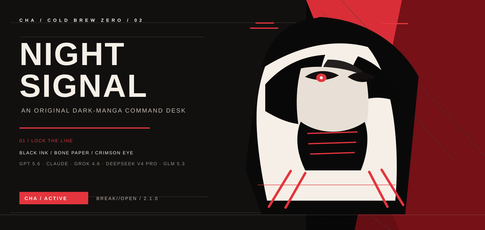
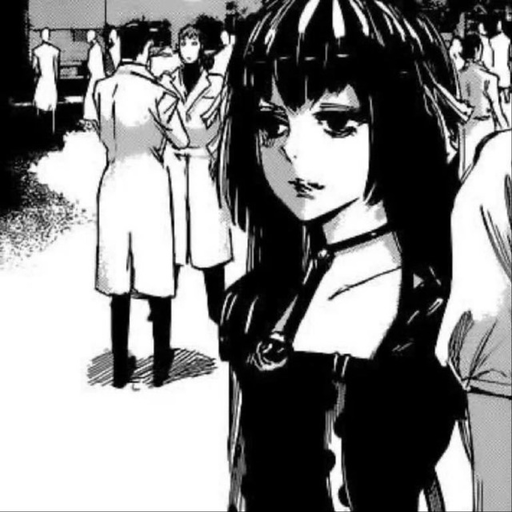
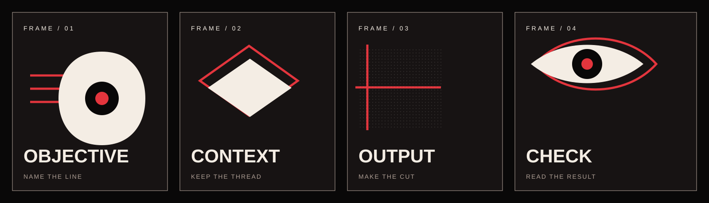
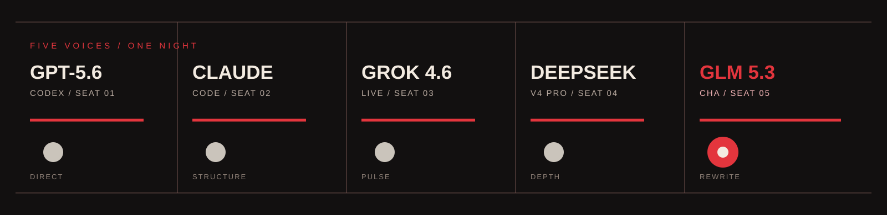
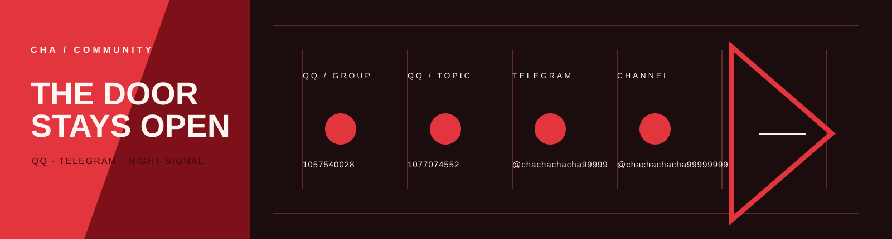

<div align="center">



<br />



# ColdBrew Zero / CHA

### gpt5.6-claude-grok4.6-deepseekv4pro-glm5.3

**BREAK//OPEN** &nbsp;|&nbsp; **NOIR MANGA RELEASE 2.1.0**

<sub>An original dark-manga visual system built from black ink, bone paper, a single crimson eye, and torn comic panels.</sub>

</div>

---

## 01 / Night Sequence

ColdBrew Zero arranges objective, context, output, and review as four panels. The repository, desktop app, and community channels now share one black, bone-white, and crimson system.

<div align="center">
  
</div>

## Quick Start

```powershell
python coldbrew.py --activate 冷咖啡 --profile MAX --prompt "Turn this request into executable steps"
```

```powershell
cd desktop
npm install
npm start
```

Build the Windows portable package with `npm run pack:win`.

## 02 / Five Seats

`GPT-5.6 / Codex`, `Claude Code`, `Grok 4.6`, `DeepSeek v4 Pro`, and `GLM 5.3` share the same night desk.

<div align="center">
  
</div>

## 03 / Community Signal

<div align="center">
  
</div>

<p align="center">
  <a href="docs/assets/qq-group-1-card.png">
    
  </a>
  <a href="docs/assets/qq-group-2-card.png">
    
  </a>
</p>

<p align="center">
  Scan to join: <strong>QQ discussion</strong> <code>1057540028</code> &nbsp;|&nbsp; <strong>QQ topic</strong> <code>1077074552</code>
</p>

[Telegram group @chachachacha99999](https://t.me/chachachacha99999) &nbsp;|&nbsp; [Telegram channel @chachachacha99999999](https://t.me/chachachacha99999999)

---

<div align="center">

`CHA / COLD BREW ZERO / BREAK//OPEN / GLM 5.3 / 2.1.0`

</div>
