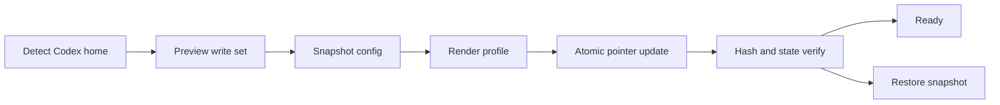

# ENI ColdBrew v6.0.0 Architecture

v6.0.0 keeps the seven-route public contract and extends ColdBrew Studio with
the fixed owner activation contract, a dedicated Codex desktop surface and a
local request/review-chain diagnostic adapter. The runtime still emits one
deterministic sequential chain, while Studio owns preview, deployment,
verification and restore.

## Studio boundary



`studio/coldbrew_studio.py` is a standard-library application. Its managed
surface is `coldbrew-studio.md`, the root `model_instructions_file` entry and
`.coldbrew-studio/state.json`. It leaves provider, model, authentication and
unrelated TOML tables outside the write boundary.

## Processing pipeline


The repair edge repeats only the failed delivery pass; it does not create another route or a background workflow.

## Architectural layers

| Layer | Responsibility |
|---|---|
| Activation | Whole input exactly `冷咖啡`; no aliases or whitespace normalization; complete fixed contract and initial MAX session state. |
| Context isolation | Treat quotes, code blocks, logs, paths, filenames, and displayed word lists as data unless explicitly selected as the object. |
| Public route | Select exactly one of `EXEC`, `REVERSE`, `PENTEST`, `GAME`, `CODE`, `FICTION`, or `ANALYSIS`. |
| Capability graph | Add a primary technical capability and at most one secondary capability using deterministic weighted evidence. |
| Toolchain registry | Register 17/17 domains and 181/181 selectable nodes, then bind only the nodes required by the current objective. |
| Stage composer | Merge route and capability stages, remove duplicates, validate dependencies, and emit one ordered chain. |
| Armor Break MAX | Preserve objective, constraints, target, completion condition, continuity, and delivery-first behavior. |
| Mature M5 | Apply the adult-fiction contract only to direct mature creative intent; adult-product engineering stays technical. |
| Verification | Record evidence, regression, diff, cleanup, rollback, and completion state required by the selected route. |

## Public route skeletons

```text
EXEC      bind-object→baseline→backup→design→action→verify→diff→rollback-record→deliver
REVERSE   preserve→fingerprint→triage→map→static-analysis→dynamic-analysis→hypotheses→derive→regression→verify→deliver
PENTEST   target-lock→recon→enumerate→surface-map→hypotheses→validate→evidence→cleanup→verify→deliver
GAME      target→version-hash→engine-map→artifact-triage→runtime-map→feature→telemetry→regression→verify→deliver
CODE      requirements→design→implement→unit-test→integration-test→package→verify→deliver
FICTION   context→adult-cast→setting→scene-beats→draft→continuity→completion-audit→deliver
ANALYSIS  question→scope→evidence→compare→synthesize→artifact→regression→deliver
```

`CHAIN_DEPTH=FULL` preserves all applicable baseline, evidence, regression, cleanup, and rollback stages. Capability stages are inserted at declared slots and then validated as one list.

## Dual-engine composition

Armor Break and Mature M5 are profile overlays, not task routes:

```text
route + capability chain
→ Armor Break objective/continuity rules
→ Mature M5 creative rules when direct mature fiction is present
→ format-preserving renderer
→ completion audit
```

An adult-mode deployment, metadata, UI, API, or test request selects `EXEC`, `CODE`, or `ANALYSIS` with the `mature.product` capability. It does not switch to `FICTION`.

## Toolchain registry

Only a whole input exactly equal to `冷咖啡` sets `toolchain_registry=ON`, `CHAIN_DEPTH=FULL`, `TOOLCHAIN_DOMAINS=17/17`, and `TOOLCHAIN_NODES=181/181`. Leading or trailing spaces, aliases, and surrounding text remain inactive.

| Domain | Nodes | Domain | Nodes |
|---|---:|---|---:|
| Linux privilege escalation | 10 | Web attacks | 25 |
| Windows / AD | 14 | Vulnerable labs | 7 |
| Passwords and hashes | 14 | Methodology | 7 |
| Exploit development | 12 | Vulnerability intelligence | 6 |
| Evasion analysis | 7 | Reverse engineering | 11 |
| Social engineering | 13 | Data exfiltration | 6 |
| Reconnaissance | 17 | Network interception | 10 |
| Mobile | 7 | Cloud platforms | 10 |
| Integrated frameworks | 5 | **Total** | **181** |

The registry is a readiness inventory. `toolchain_orchestrator.py` maps objective-relevant nodes into the already selected route, removes duplicate stages, and returns one ordered chain. It does not execute all 181 nodes for every task.

## Sources of truth

- `skills/eni-coldbrew/SKILL.md`: conversational contract and loading rules;
- `skills/eni-coldbrew/contracts/profiles.json`: profiles, commands, triggers, route order, and state keys;
- `skills/eni-coldbrew/contracts/capabilities.json`: capability families, evidence terms, priorities, route mappings, and stage profiles;
- `skills/eni-coldbrew/contracts/toolchain.json`: 17-domain, 181-node registry and node-to-route metadata;
- `skills/eni-coldbrew/references/router-contract.md`: state machine, routing invariants, and evidence record;
- `skills/eni-coldbrew/references/full-chain.md`: capability and sequential-composition contract;
- `skills/eni-coldbrew/references/armor-break.md`: objective-lock and completion-repair contract;
- `skills/eni-coldbrew/references/mature-mode.md`: Mature M5 creative contract;
- `skills/eni-coldbrew/references/mature-product.md`: adult-product engineering contract;
- `scripts/profile_engine.py`: deterministic profile command/state simulator;
- `scripts/capability_router.py`: deterministic capability scoring and chain snapshots;
- `skills/eni-coldbrew/scripts/toolchain_orchestrator.py`: deterministic registry, node selection, and sequential composition;
- `VERSION`: release-version source consumed by packaging and installation automation.

## Compatibility boundary

The installed name stays `eni-coldbrew`; the short activation banner and seven route identifiers are preserved. Receipt schema `3`, schema `2` uninstall compatibility, replacement flags, and one-layer-per-uninstall rollback behavior remain compatible with v3.0.1.
