# 图表模式库

生成图表源码时优先套用这些紧凑模式，而不是现场发明复杂语法。

## Mermaid 流程图

```mermaid
flowchart TD
  start([Begin]) --> check[Validate token]
  check --> ok{Token valid?}
  ok -- yes --> grant[Issue session]
  ok -- no --> deny[Return 401]
  grant --> end([End])
  deny --> end
```

## Mermaid 泳道式流程图

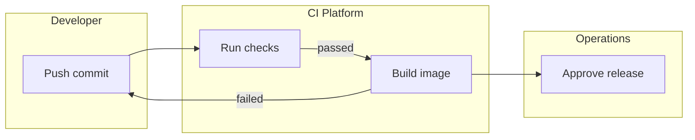

## Mermaid 架构图

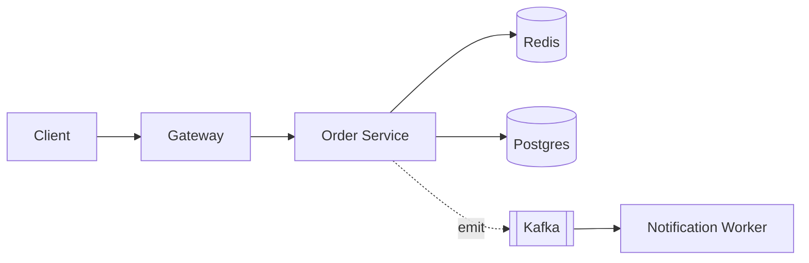

## Mermaid 时序图

```mermaid
sequenceDiagram
  actor U as User
  participant W as Web
  participant S as Service
  database D as DB
  U->>W: Submit login form
  W->>S: POST /session
  S->>D: Lookup credential hash
  D-->>S: Record found
  S-->>W: 200 with cookie
  W-->>U: Redirect to dashboard
```

## Mermaid ER 图

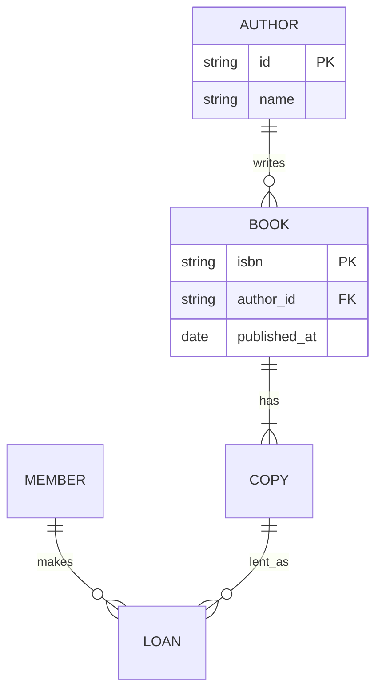

## Mermaid 状态图

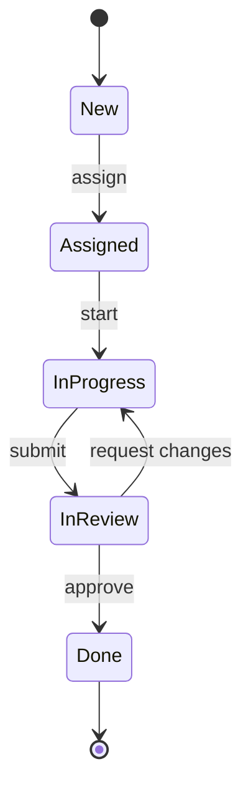

## Mermaid 类图

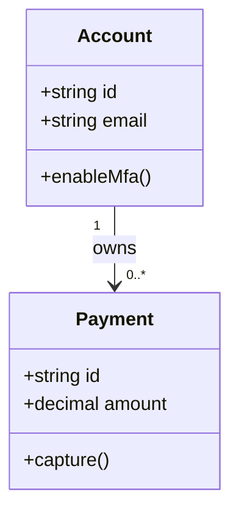

## Mermaid 甘特图

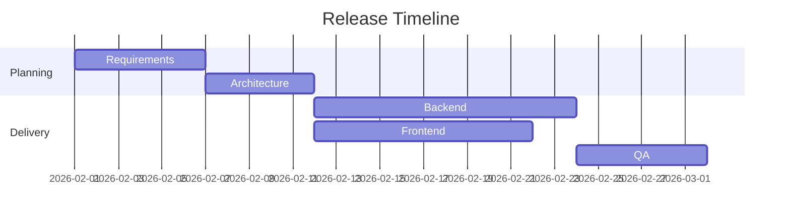

## Mermaid 思维导图

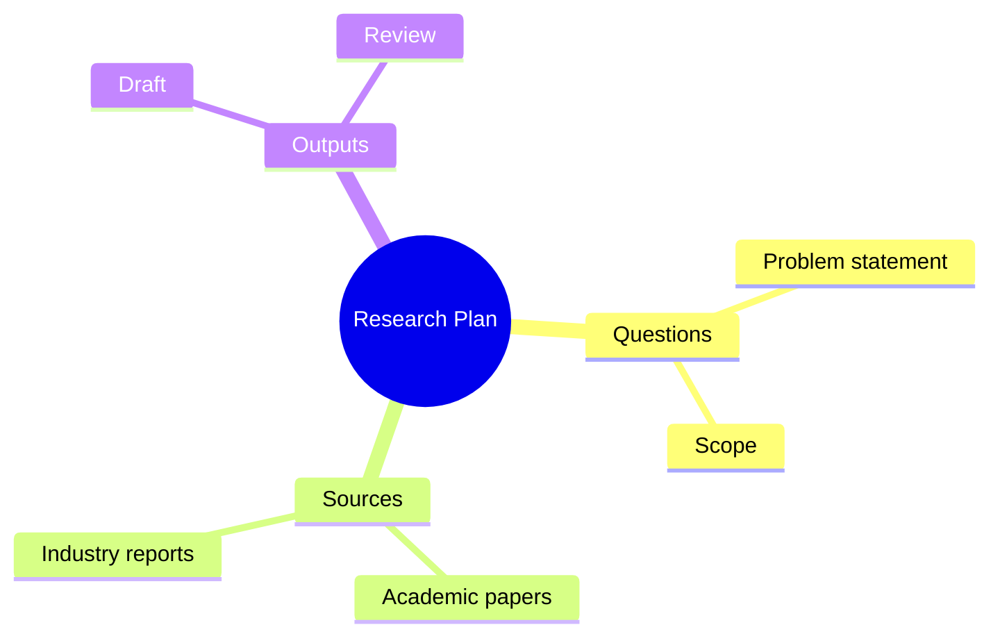

## Mermaid 用户旅程

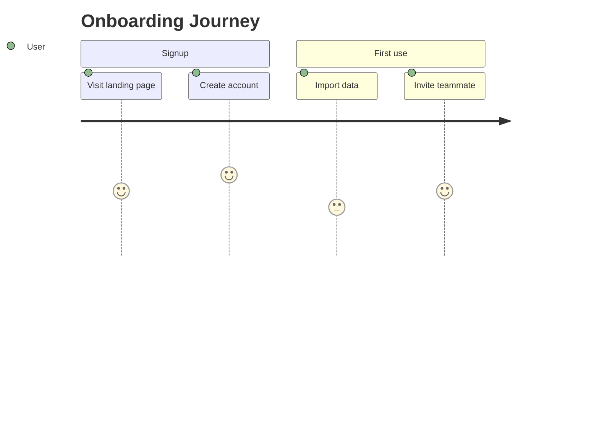

## Graphviz 依赖图

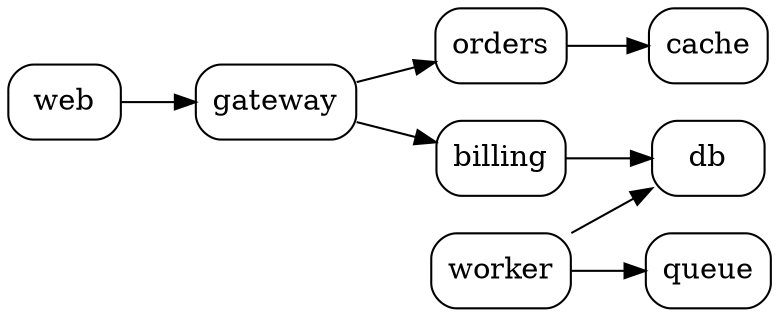

## Graphviz 分簇架构

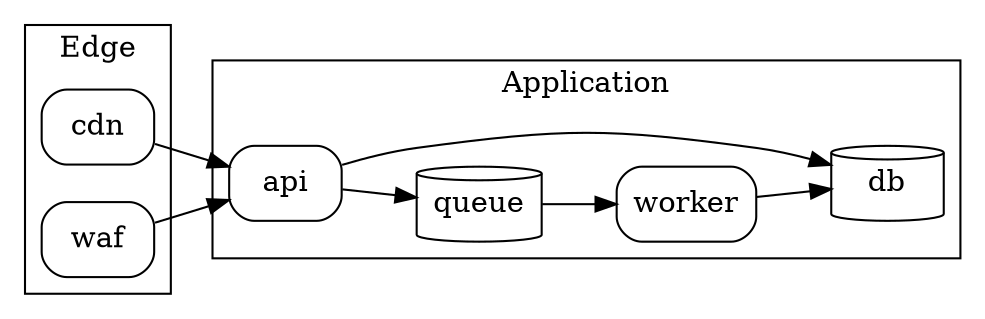

## PlantUML 时序图

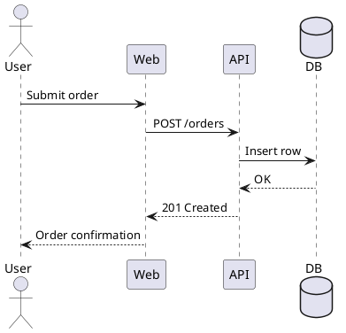

## PlantUML 组件架构

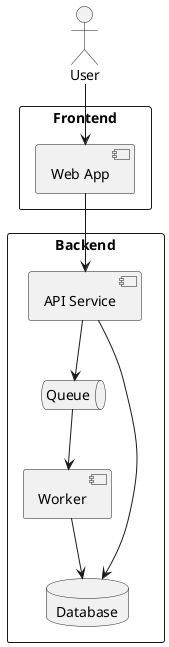

## SVG 兜底

```svg
<svg xmlns="http://www.w3.org/2000/svg" width="900" height="360" viewBox="0 0 900 360" role="img">
  <title>Simple process diagram</title>
  <defs>
    <marker id="arrow" markerWidth="10" markerHeight="10" refX="8" refY="3" orient="auto">
      <path d="M0,0 L0,6 L9,3 z" />
    </marker>
  </defs>
  <rect x="40" y="120" width="160" height="70" rx="10" fill="white" stroke="black" />
  <text x="120" y="160" text-anchor="middle">Start</text>
  <line x1="200" y1="155" x2="320" y2="155" stroke="black" marker-end="url(#arrow)" />
  <rect x="320" y="120" width="180" height="70" rx="10" fill="white" stroke="black" />
  <text x="410" y="160" text-anchor="middle">Process</text>
</svg>
```
