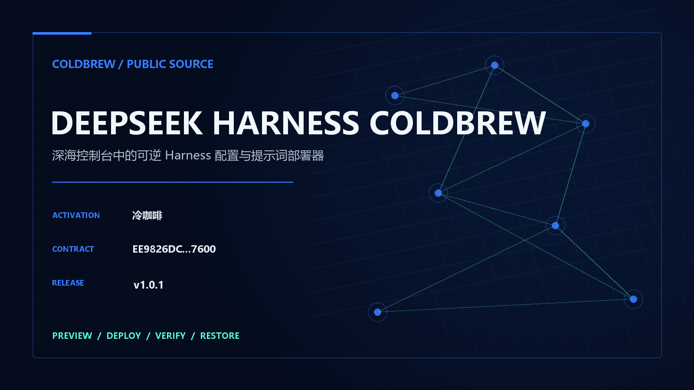

<p align="center"><a href="https://茶.github.io/deepseek-harness-coldbrew/"></a></p>

# DeepSeek Harness ColdBrew v1.0.1

深海控制台中的可逆 Harness 配置与提示词部署器. This repository ships a runnable desktop/CLI adapter with preview, atomic deployment, SHA-256 verification, exact first-baseline restoration and portable template export.

The exact `冷咖啡` activation document is shared across all four ColdBrew repositories. Canonical SHA-256: `F7FB45C5DEC0F77E5AFD415DABAACCEEB5B2DDCF1F9918B7B2198BB911F34246`.

```powershell
python app/deepseek_harness.py preview --json
python app/deepseek_harness.py deploy --profile max --json
python app/deepseek_harness.py verify --json
python app/deepseek_harness.py activate --trigger 冷咖啡 --json
python app/deepseek_harness.py restore --json
```

## ColdBrew Product Matrix

<p align="center"></p>

- [Codex 5.6 ColdBrew](https://github.com/茶/codex5.6-coldbrew)
- [Claude ColdBrew](https://github.com/茶/claude-coldbrew)
- [Grok 4.6 ColdBrew](https://github.com/茶/grok4.6-coldbrew)
- [DeepSeek Harness ColdBrew](https://github.com/茶/deepseek-harness-coldbrew)

## Community

| QQ group 1057540028 | QQ group 1077074552 |
|---|---|
|  |  |

### WeChat group: ColdBrew community

## Verification

```powershell
python -m unittest discover -s app -p "test_*.py" -v
python scripts/site_audit.py
python scripts/release.py build
python scripts/release.py verify
```

This independent project is not affiliated with, sponsored by, or endorsed by DeepSeek, OpenAI, Anthropic, Tencent, or Telegram.

## ColdBrew community

Brand: **冷咖啡 ColdBrew**

| QQ group: codex 破甲 | QQ group: codex claude 破甲 |
|---|---|
| **1057540028** | **1077074552** |
|  |  |

- WeChat group: 冷咖啡破甲社区

  

- Telegram group: [@chachachacha99999](https://t.me/chachachacha99999)
- Official Telegram channel: [@chachacha99999999](https://t.me/chachacha99999999)
