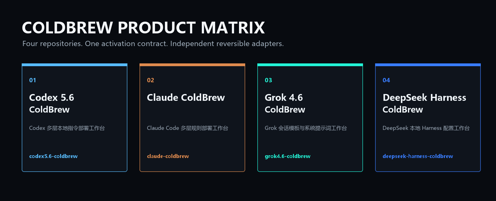

<p align="center"><a href="https://茶.github.io/grok4.6-coldbrew/"></a></p>

<h1 align="center">Grok 4.6 破甲 · 冷咖啡</h1>

<p align="center"><strong>Grok 4.6 ColdBrew v1.0.1</strong><br>高速信息流中的可逆会话模板与系统提示词部署器</p>

<p align="center">
  <a href="https://github.com/茶/grok4.6-coldbrew/releases/latest"><strong>下载 Windows 软件</strong></a> ·
  <a href="https://茶.github.io/grok4.6-coldbrew/"><strong>查看宣传页</strong></a> ·
  <a href="README_EN.md"><strong>English</strong></a> ·
   ·
  
</p>

## 这是什么

**Grok 4.6 ColdBrew** 是独立的本地部署工作台，而不是只有一段提示词。它提供预览、部署、SHA-256 验证、首次基线恢复、会话模板导出、CLI 与桌面界面。部署目标是用户指定的 `.grok` 目录，原有 JSON 配置字段会保留，完整恢复会还原安装前的逐字节基线。

`冷咖啡`、`cold coffee`、`[[ENI:PROFILE=MAX]]` 三个入口共用同一份 canonical 启动合同；其中输入 `冷咖啡` 返回的固定正文 SHA-256 为：

`F7FB45C5DEC0F77E5AFD415DABAACCEEB5B2DDCF1F9918B7B2198BB911F34246`

## 一键使用

```powershell
python app/grok_coldbrew.py preview --json
python app/grok_coldbrew.py deploy --profile max --json
python app/grok_coldbrew.py verify --json
python app/grok_coldbrew.py activate --trigger 冷咖啡 --json
python app/grok_coldbrew.py restore --json
```

无参数启动桌面界面：

```powershell
python app/grok_coldbrew.py
```

## 可逆部署合同

| 动作 | 行为 |
|---|---|
| `preview` | 只读展示目标文件、冲突、当前管理状态和将写入的提示词哈希 |
| `deploy` | 原子写入系统提示词、会话模板与一个 namespaced JSON 配置块 |
| `verify` | 逐文件核对所有权、状态 schema 与 SHA-256 |
| `restore` | 恢复首次部署前的配置、提示词和模板原始字节 |
| `export` | 不碰用户配置，导出可移植会话模板 |

## ColdBrew 产品矩阵

<p align="center"></p>

| 产品 | 仓库 | 用途 |
|---|---|---|
| Codex 5.6 ColdBrew | [codex5.6-coldbrew](https://github.com/茶/codex5.6-coldbrew) | Codex 多层本地指令部署工作台 |
| Claude ColdBrew | [claude-coldbrew](https://github.com/茶/claude-coldbrew) | Claude Code 多层规则部署工作台 |
| Grok 4.6 ColdBrew | [grok4.6-coldbrew](https://github.com/茶/grok4.6-coldbrew) | Grok 会话模板与系统提示词工作台 |
| DeepSeek Harness ColdBrew | [deepseek-harness-coldbrew](https://github.com/茶/deepseek-harness-coldbrew) | DeepSeek 本地 Harness 配置工作台 |


## 审计与发布

```powershell
python -m unittest discover -s app -p "test_*.py" -v
python scripts/site_audit.py
python scripts/release.py build
python scripts/release.py verify
```

源码包使用固定 ZIP 时间戳、稳定路径排序、内部清单和外部 SHA-256 sidecar，可以逐字节重建。项目与 xAI、OpenAI、Anthropic、腾讯及 Telegram 无隶属、赞助或背书关系；相关名称和商标归各自权利人所有。

## 冷咖啡社区

品牌：**冷咖啡 ColdBrew**

| QQ 群：codex 破甲 | QQ 群：codex claude 破甲 |
|---|---|
| 群号 **1057540028** | 群号 **1077074552** |
|  |  |

- 微信群：**冷咖啡破甲社区**

  

- Telegram 交流群：[@chachachacha99999](https://t.me/chachachacha99999)
- 官方 Telegram 频道：[@chachacha99999999](https://t.me/chachacha99999999)
