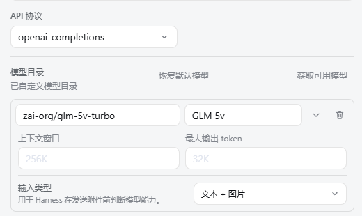

<div align="center">

# 🎛️ dsh-model-capability


**Choose a model's supported input modalities directly in DeepSeek Harness.**

[简体中文](README.md) · **English**

[](https://github.com/WJZ-P/dsh-model-capabilities/actions/workflows/ci.yml)


</div>

---

## Features

- Adds an **Input modalities** selector to native Harness model rows.
- Supports provider defaults, text, image, and text-plus-image declarations.
- Writes the standard model `input` field used by Harness attachment checks.
- Extends `settings.models.model.fields` without taking over validation or persistence.
- Follows Harness light/dark theme tokens and English/Chinese locale state.
- Uses the standard DSH bundle and Web client discovery contracts without Tauri APIs.

## Example

The model editor below explicitly declares **Text + image** input, allowing Harness to treat image attachments as supported model input:

<p align="center">
  
</p>

## Modality mapping

| Selection | Stored model value |
| --- | --- |
| Inherit provider default | `input` omitted |
| Text | `["text"]` |
| Text + image | `["text", "image"]` |
| Image | `["image"]` |

## Install

```bash
dsh plugin --profile web add dsh-model-capability
dsh --profile web --dump-config
dsh --profile web
```

Remove the plugin:

```bash
dsh plugin --profile web remove dsh-model-capability
```

## Development

```bash
pnpm install
pnpm run build
pnpm test
npm pack --dry-run
```

The current release targets DeepSeek Harness `0.1.0-rc.5`, its standard Web client discovery path, and the `settings.models.model.fields` extension slot.

## Marketplace

The ready-to-copy catalog entry, pull-request checklist, and screenshot naming convention are documented in [`MARKETPLACE.md`](MARKETPLACE.md). Recommended screenshots show the input-modality field and its expanded option list; the marketplace entry references GitHub-hosted image URLs.

## Security

The plugin updates only the current model row's `input` field through Harness's public settings slot. See [`SECURITY.md`](SECURITY.md) for supported versions, issue scope, and private-reporting guidance.

## License

[MIT](LICENSE)
